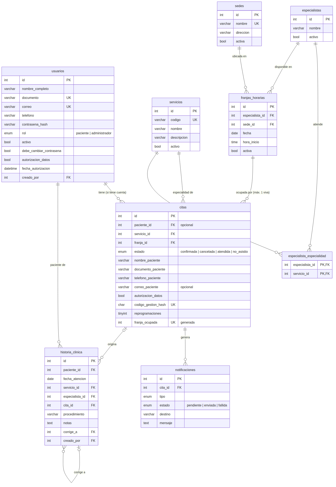

# Modelo de datos — Arte Odontológico

Versión del 6 de octubre de 2026 · MySQL 8.0 · motor InnoDB · codificación `utf8mb4`.\
Fuente de verdad: `backend/database/schema.sql`. Cambios para bases existentes: `backend/database/migraciones/`.

## Diagrama entidad-relación

El diagrama se genera desde `diagrama-er.mmd` (Mermaid).

**Cómo leerlo:**
- Una cita pertenece a una hora publicada (franja), y cada franja es de un especialista en la sede.
- La cita puede o no estar ligada a un usuario: quien agenda sin cuenta queda registrado con sus datos dentro de la cita.
- La historia clínica solo existe para pacientes con usuario.

## Tablas

### `usuarios`
Secretaria (rol `administrador`) y pacientes con cuenta (rol `paciente`) en una sola tabla. El rol lo fija el servidor; nunca viene del cliente.

| Columna | Tipo | Notas |
|---|---|---|
| `id` | INT UNSIGNED PK | |
| `nombre_completo` | VARCHAR(120) | |
| `documento` | VARCHAR(20) UNIQUE | Solo dígitos |
| `correo` | VARCHAR(160) UNIQUE | Usuario de ingreso |
| `telefono` | VARCHAR(20) | Con indicativo (57…) |
| `contrasena_hash` | VARCHAR(255) | bcrypt |
| `rol` | ENUM('paciente','administrador') | |
| `activo` | BOOLEAN | Cuenta desactivada = no puede ingresar |
| `debe_cambiar_contrasena` | BOOLEAN | TRUE mientras use la clave temporal |
| `autorizacion_datos`, `fecha_autorizacion`, `version_politica_datos` | | Prueba de la autorización (Ley 1581 de 2012) |
| `autorizacion_registrada_por` | FK → usuarios | Secretaria que recogió la autorización |
| `creado_por` | FK → usuarios | Secretaria que creó la cuenta |

### `servicios` (especialidades)
| Columna | Tipo | Notas |
|---|---|---|
| `id` | PK | |
| `codigo` | VARCHAR(40) UNIQUE | Identificador estable (sirve al frontend para el ícono) |
| `nombre`, `descripcion` | | |
| `activo` | BOOLEAN | Las inactivas no se ofrecen al público |
| `duracion_minutos` | SMALLINT | Heredada; el sistema ya no la usa |

### `especialistas` y `especialista_especialidad`
Odontólogos que atienden. No tienen usuario. La tabla intermedia (llave primaria compuesta) permite que un especialista atienda varias especialidades.

### `sedes`
Una fila activa: Rivera (Carrera 7 No. 3-61). La tabla se conserva por si el consultorio abre otra sede.

### `franjas_horarias`
Cada fila es una hora que la secretaria publicó a mano para un especialista.

| Columna | Notas |
|---|---|
| `especialista_id`, `sede_id` | FK |
| `fecha`, `hora_inicio` | Hora local del consultorio |
| `activa` | FALSE cuando la secretaria la quita (no se borra si alguna cita antigua la referencia) |
| UNIQUE (`especialista_id`, `fecha`, `hora_inicio`) | Un especialista no publica dos veces la misma hora |

Una franja está **libre** si está activa, todavía no pasó y no tiene una cita viva.

### `citas`
| Columna | Notas |
|---|---|
| `paciente_id` | FK opcional: solo si agendó un paciente con su sesión, o se vinculó al crearle la cuenta |
| `servicio_id`, `franja_id` | Especialidad y hora |
| `estado` | `confirmada`, `cancelada`, `atendida`, `no_asistio` (y `pendiente`, reservado) |
| `nombre_paciente`, `documento_paciente`, `telefono_paciente`, `correo_paciente` | Datos de quien agenda; el correo es opcional |
| `autorizacion_datos`, `fecha_autorizacion`, `version_politica_datos` | Autorización dada al agendar |
| `codigo_gestion_hash` | SHA-256 del código del enlace "Gestionar mi cita" (UNIQUE) |
| `reprogramaciones` | Las que hizo el paciente (máximo 1) |
| `cancelada_por` | `paciente` o `administrador` |
| `franja_ocupada` | **Columna generada**: `franja_id` si la cita no está cancelada, NULL si lo está. Su índice único garantiza que una hora tenga una sola cita viva, aun con peticiones simultáneas |

### `notificaciones`
Bitácora de mensajes de WhatsApp: `tipo` (`confirmacion`, `reprogramacion`, `cancelacion`, `recordatorio`), `estado` (`pendiente`, `enviada`, `fallida`), `destino`, `mensaje` (texto enviado o por enviar) y `detalle` (id del proveedor o error).

### `historia_clinica`
| Columna | Notas |
|---|---|
| `paciente_id` | FK → usuarios (solo pacientes con cuenta) |
| `fecha_atencion` | No puede ser futura |
| `servicio_id`, `especialista_id`, `cita_id` | Opcionales |
| `procedimiento`, `notas` | |
| `corrige_a` | FK → historia_clinica: la entrada que esta corrige |
| `creado_por`, `creado_en` | Autor y momento |

No se actualiza ni se borra (Resolución 1995 de 1999). Las llaves foráneas usan `ON DELETE RESTRICT` hacia el paciente y la entrada corregida.

### Vista `v_agenda`
Une citas, especialidad, especialista y sede para consultas de la agenda.

## Decisiones de diseño
- **Datos de quien agenda dentro de la cita** (y no en `usuarios`): permite agendar sin cuenta sin llenar `usuarios` de registros de personas que quizá nunca asistan.
- **Columna generada para la doble reserva**: la regla queda en el motor y no depende de que el código la recuerde.
- **Desactivar en vez de borrar** franjas, especialistas y especialidades: conserva la integridad de las citas antiguas.
- **Normalización:** tercera forma normal. La excepción deliberada son los datos de contacto copiados en la cita, que son la "foto" de lo que la persona escribió al agendar.
