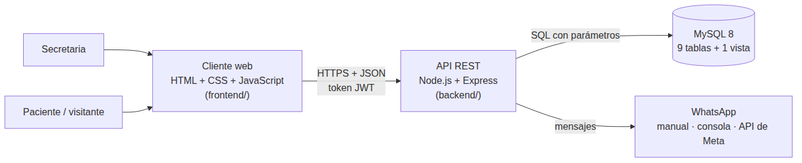

# Manual técnico — Arte Odontológico

**Proyecto:** plataforma web de agendamiento de citas para el consultorio Arte Odontológico\
**Programa:** Ingeniería de Software — Fundación Escuela Tecnológica de Neiva Jesús Oviedo Pérez\
**Autores:** Emmanuel Artunduaga Charry · Jawer Leonardo Manrique Yosa\
**Versión del documento:** 0.9 (borrador) · 6 de octubre de 2026

> Pendiente: sección del frontend (pantallas y módulos JavaScript) cuando termine la integración; despliegue; paso a la plantilla oficial de la FET.

## 1. Propósito y alcance

Describe cómo está construido el sistema: arquitectura, organización del código, modelo de datos, API, reglas de negocio, seguridad y pruebas. Está dirigido a quien mantenga o amplíe el sistema. Para instalarlo, ver el *Manual de instalación*.

El sistema permite que cualquier persona agende una cita odontológica desde la web sin crear cuenta, eligiendo especialidad, especialista, día y hora. Recibe la confirmación por WhatsApp y puede reprogramar una vez o cancelar desde un enlace. La secretaria, único usuario administrador, gestiona especialidades, especialistas, disponibilidad, agenda, pacientes e historia clínica. Los pacientes que ya asistieron pueden tener usuario, que crea la secretaria.

## 2. Arquitectura

Arquitectura cliente-servidor en tres capas:

- **Cliente:** páginas estáticas que consumen la API con `fetch`. No guardan lógica de negocio: toda regla se valida en el servidor.
- **API:** Express organizado por capas (rutas → controladores → modelos), sin ORM. Las consultas SQL están escritas a mano con parámetros (`?`).
- **Base de datos:** MySQL 8 con InnoDB, `utf8mb4`, integridad referencial con llaves foráneas y restricciones únicas que hacen cumplir reglas del negocio (por ejemplo, una sola cita viva por hora).

## 3. Tecnologías

| Capa | Tecnología | Versión | Uso |
|---|---|---|---|
| Servidor | Node.js | 18 o superior | Entorno de ejecución |
| | Express | 4.x | Servidor HTTP y enrutamiento |
| | mysql2 | 3.x | Conexión a MySQL con pool y consultas preparadas |
| | bcrypt | 6.x | Cifrado de contraseñas (10 rondas) |
| | jsonwebtoken | 9.x | Sesiones con token firmado (JWT) |
| | dotenv, cors | — | Configuración y política de origen |
| Datos | MySQL | 8.0+ | Base de datos relacional |
| Cliente | HTML5, CSS3, JavaScript (ES2020) | — | Interfaz sin frameworks |
| Mensajería | WhatsApp Cloud API (opcional) | Graph API v21 | Envío automático de mensajes |
| Control de versiones | Git + GitHub | — | Ramas por tarea y Pull Requests |

No hay más dependencias de producción: las funciones de fecha, aleatoriedad y hash usan los módulos nativos de Node (`Intl`, `crypto`).

## 4. Organización del código

| Carpeta o archivo | Contenido |
|---|---|
| `backend/database/schema.sql` | Esquema completo y datos iniciales (instalación nueva) |
| `backend/database/migraciones/` | Cambios para bases existentes, en orden (001, 002…) |
| `backend/src/server.js` | Arranque: prueba la conexión y abre el puerto |
| `backend/src/app.js` | Express, CORS, JSON, rutas y manejador de errores |
| `backend/src/config/db.js` | Pool de conexiones MySQL |
| `backend/src/routes/` | Qué URL va a qué controlador y con qué permisos |
| `backend/src/controllers/` | Validación de entrada, reglas de negocio y respuesta |
| `backend/src/models/` | Consultas SQL |
| `backend/src/middleware/` | Sesión, rol y límite de peticiones |
| `backend/src/services/notificaciones/` | Textos y envío de WhatsApp |
| `backend/src/utils/` | Validaciones, fechas, códigos, errores, contraseñas |
| `backend/src/scripts/` | Consola: `crearAdmin.js` (crear la secretaria), `restablecerAdmin.js` (restablecer su clave) y `enviarRecordatorios.js` |
| `backend/src/services/recordatorios.js` | Recordatorio del día anterior y su ejecución automática |
| `backend/.env.example` | Plantilla de configuración |
| `frontend/` | `index.html`, `politica-datos.html`, `css/` (tokens → base → pantalla), `js/` (config y un módulo por pantalla), `paciente/`, `admin/` |
| `docs/` | Documentación del proyecto |

**Flujo de una petición:** `routes` aplica los middlewares (sesión, rol, límite) → el `controller` valida el cuerpo con `utils/validaciones`, aplica las reglas y llama a los `models` → si algo falla lanza un `ErrorHttp(status, mensaje, campos)` → el manejador central de `app.js` responde `{ error, campos? }` sin exponer detalles internos (la traza completa queda solo en la consola del servidor).

## 5. Modelo de datos

El detalle de cada tabla y el diagrama entidad-relación están en `docs/03-diseno/modelo-de-datos.md`. Resumen:

| Tabla | Propósito |
|---|---|
| `usuarios` | Secretaria (rol `administrador`) y pacientes con cuenta (rol `paciente`) |
| `servicios` | Especialidades del consultorio |
| `especialistas` | Odontólogos; no inician sesión |
| `especialista_especialidad` | Qué especialidades atiende cada especialista (muchos a muchos) |
| `sedes` | Sede de atención (hoy solo Rivera) |
| `franjas_horarias` | Horas publicadas a mano por la secretaria, por especialista y fecha |
| `citas` | Citas, con los datos de quien agenda aunque no tenga cuenta |
| `notificaciones` | Bitácora de mensajes de WhatsApp |
| `historia_clinica` | Entradas por paciente; no se modifican ni se borran |
| `v_agenda` (vista) | Agenda con paciente, especialidad, especialista y sede |

## 6. API REST

Todas las rutas cuelgan de `/api` y responden JSON. El contrato completo con ejemplos está en `docs/03-diseno/contrato-api.md`.

| Grupo | Método y ruta | Acceso |
|---|---|---|
| Salud | `GET /salud` | Público |
| Catálogo | `GET /especialidades` · `GET /especialidades/:id/especialistas` | Público |
| Calendario | `GET /especialistas/:id/calendario?mes=` · `GET /especialistas/:id/horas?fecha=` | Público |
| Agendar | `POST /citas` | Público (con sesión opcional de paciente) |
| Gestionar cita | `GET /citas/gestion/:codigo` · `POST …/reprogramar` · `POST …/cancelar` | Público con código |
| Sesión | `POST /auth/ingreso` · `POST /auth/cambiar-contrasena` · `GET /auth/perfil` | Público / sesión |
| Paciente | `GET /mis-citas` | Rol paciente |
| Pacientes | `POST /pacientes` · `GET /pacientes?q=` · `GET /pacientes/:id` · `POST /pacientes/:id/restablecer-contrasena` | Rol administrador |
| Historia clínica | `GET/POST /pacientes/:id/historia` · `POST /admin/historia/:id/correccion` | Rol administrador |
| Especialidades | `GET/POST /admin/especialidades` · `PATCH /admin/especialidades/:id` | Rol administrador |
| Especialistas | `GET/POST /admin/especialistas` · `PATCH /admin/especialistas/:id` | Rol administrador |
| Disponibilidad | `GET/POST /admin/especialistas/:id/franjas` · `DELETE /admin/franjas/:id` | Rol administrador |
| Agenda | `GET /admin/citas` · `PATCH /admin/citas/:id/estado` · `POST /admin/citas/:id/reprogramar` | Rol administrador |
| Mensajes | `GET /admin/notificaciones` · `PATCH /admin/notificaciones/:id` · `POST /admin/recordatorios` | Rol administrador |

**Códigos de respuesta:**
- 200 / 201: correcto.
- 400: datos inválidos, con `campos` por cada error.
- 401: sin sesión o sesión vencida.
- 403: sin permiso.
- 404: no existe.
- 409: conflicto con una regla del negocio, por ejemplo una hora ya tomada.
- 429: demasiadas peticiones.
- 500: error interno, con mensaje genérico.

## 7. Reglas de negocio y cómo se implementan

| Regla | Implementación |
|---|---|
| Una hora admite una sola cita viva | Columna generada `citas.franja_ocupada = IF(estado='cancelada', NULL, franja_id)` con índice único. Si dos personas confirman a la vez, el motor rechaza la segunda (`ER_DUP_ENTRY` → 409). Al cancelar, la hora se libera sola |
| La cita queda confirmada al agendar | `estado = 'confirmada'` en `cita.model.crear` |
| Agendar sin cuenta con nombre, documento y teléfono (correo opcional) | `validarDatosPersona`; el teléfono se normaliza con indicativo 57 |
| Autorización de datos obligatoria (Ley 1581 de 2012) | `autorizacionDatos === true`; se guarda la fecha y la versión de la política en la cita |
| Máximo 1 cita activa por documento sin cuenta | `contarActivasPorDocumento`; configurable con `LIMITE_CITAS_ACTIVAS_SIN_USUARIO` |
| La cita queda a nombre de un paciente solo si agenda con su sesión | Middleware `sesionOpcional` y comparación del documento con el usuario de la sesión |
| El paciente reprograma una sola vez | `UPDATE … WHERE reprogramaciones < 1` (la condición va en la misma sentencia para evitar dobles clics) |
| Reprogramar o cancelar hasta 24 h antes | `reglasGestion` compara la fecha y hora de la cita con la hora de Bogotá + 24 h |
| La secretaria reprograma sin límite y puede cambiar de especialista | `reprogramarAdmin` no toca el contador; valida que el especialista atienda la especialidad |
| No quitar una hora con cita | `quitarFranja` responde 409 si hay cita viva; si no, la desactiva (no la borra) |
| Marcar asistencia solo cuando llegó la hora | `cambiarEstado` compara con la hora actual |
| Las citas canceladas no se borran | Estado `cancelada` y `cancelada_por` |
| Historia clínica inalterable | Solo hay `INSERT`; la corrección es una entrada nueva con `corrige_a` |
| Pacientes con cuenta solo los crea la secretaria | No hay registro público; `POST /pacientes` exige rol administrador |
| Recordatorio el día anterior, una sola vez | `services/recordatorios.js`: cada 30 min dentro de `RECORDATORIO_DESDE`–`RECORDATORIO_HASTA`; citas confirmadas de mañana agendadas hace más de 12 h y sin recordatorio posterior a su última confirmación o reprogramación |
| "Olvidé mi contraseña" | La secretaria genera una clave temporal nueva (`debe_cambiar_contrasena = TRUE`); la de la secretaria se restablece por consola |

**Zona horaria.** Las franjas guardan fecha y hora locales del consultorio. `utils/tiempo.js` calcula la hora actual de Bogotá (UTC-5) con `Intl` y la pasa a las consultas como texto, de modo que el resultado no depende de la zona horaria del servidor donde se publique.

## 8. Seguridad

| Riesgo | Medida |
|---|---|
| Robo de contraseñas | bcrypt con 10 rondas; nunca se guardan ni se devuelven en texto plano. La clave temporal del paciente se muestra una sola vez y se exige cambiarla |
| Suplantación de rol | El rol viaja dentro del JWT firmado por el servidor y se verifica en cada ruta con `requiereRol`; el cliente nunca lo envía |
| Adivinar correos registrados | El ingreso responde el mismo mensaje y tarda lo mismo si el correo no existe (comparación contra un hash de relleno) |
| Inyección SQL | Todas las consultas usan parámetros; las búsquedas escapan los comodines de `LIKE` |
| Enlaces de gestión adivinables | Código aleatorio de 32 bytes; en `citas` solo se guarda su hash SHA-256. Cuando la secretaria reprograma, se genera uno nuevo y el anterior deja de servir. Al marcar un mensaje como enviado, el código se borra del texto guardado |
| Bots que llenan la agenda | Límite de peticiones por IP, campo trampa oculto en el formulario y máximo de citas activas por documento |
| Fuga de datos en mensajes | El WhatsApp solo lleva fecha, hora, especialista y dirección; nada clínico |
| Errores que revelan detalles internos | Manejador central: mensaje genérico al cliente, traza solo en el servidor |
| Peticiones enormes | Cuerpo JSON limitado a 100 KB; listas de fechas y horas con tope |
| Secretos en el repositorio | `.env` en `.gitignore`; solo se publica `.env.example` |

## 9. Notificaciones

`services/notificaciones/NotificacionService.notificarCita({ citaId, tipo, codigo })` arma el texto (`mensajes.js`), lo guarda en `notificaciones` y lo entrega a `ProveedorWhatsApp` según `WHATSAPP_MODO`:

- **manual:** queda pendiente. El panel muestra un enlace `https://wa.me/<número>?text=<mensaje>` que abre el WhatsApp Business de la clínica con el texto listo.
- **consola:** se imprime en la terminal del backend.
- **api:** se envía con una plantilla aprobada por la API de WhatsApp Cloud.

El servicio nunca lanza errores hacia el controlador: si el envío falla, la cita sigue confirmada y el mensaje queda como `fallida` para enviarlo a mano. Tipos: `confirmacion`, `reprogramacion`, `cancelacion` y `recordatorio`. Solo los dos primeros llevan el enlace de gestión: el recordatorio sale cuando ya pasó el plazo de 24 horas y la cancelación ya no lo necesita.

El recordatorio lo genera `services/recordatorios.js`, programado desde `server.js` cada 30 minutos (se desactiva con `RECORDATORIOS_AUTOMATICOS=false`). También se puede lanzar con `POST /api/admin/recordatorios` o `npm run recordatorios`.

## 10. Pruebas

- **Integración contra MySQL 8 real:** 117 comprobaciones automatizadas sobre una base limpia. Cubren el catálogo, el calendario, agendar, la carrera por la misma hora, la gestión con código, la regla de 24 horas, el panel de la secretaria, los mensajes, los permisos, el alta de pacientes, la historia clínica, el recordatorio y el restablecimiento de claves. Todas correctas al 7 de octubre de 2026.
- **Pruebas manuales:** guías paso a paso en PowerShell (`docs/06-pruebas/`).
- **Revisión de código independiente:** encontró tres fallas, corregidas antes de fusionar: suplantación del documento de un paciente registrado, código del enlace guardado en texto y error 500 con fechas inválidas.

Detalle en `docs/06-pruebas/pruebas.md`.

## 11. Convenciones de trabajo

- **Ramas:** `main` solo recibe cambios por Pull Request revisado por el otro integrante. Una rama por tarea: `feature/B-XX-descripcion`, `fix/…` o `docs/…`.
- **Commits:** Conventional Commits (`feat:`, `fix:`, `docs:`, `refactor:`, `test:`, `chore:`).
- **Base de datos:** todo cambio de esquema va en `schema.sql` (instalación nueva) **y** en una migración numerada (bases existentes). Se verifica que ambos caminos produzcan el mismo esquema.
- **Estilos:** solo valores de `tokens.css`; sin colores sueltos.
- **Código:** nombres en español, comentarios que explican el porqué, SQL con parámetros.

## 12. Cómo extender el sistema

- **Nueva ruta:** agregar la función en un controlador, montarla en `routes/` con sus middlewares y documentarla en el contrato de API.
- **Nuevo campo en una tabla:** cambiarlo en `schema.sql`, crear la migración siguiente (por ejemplo `003_…sql`) y actualizar el modelo.
- **Otro canal de mensajes:** crear un proveedor en `services/notificaciones/proveedores/` con la misma firma `enviar({ destino, texto, tipo, datos })`.
- **Otra sede:** insertar la fila en `sedes`. El modelo ya la soporta; habría que agregar su elección en el flujo de agendar.
